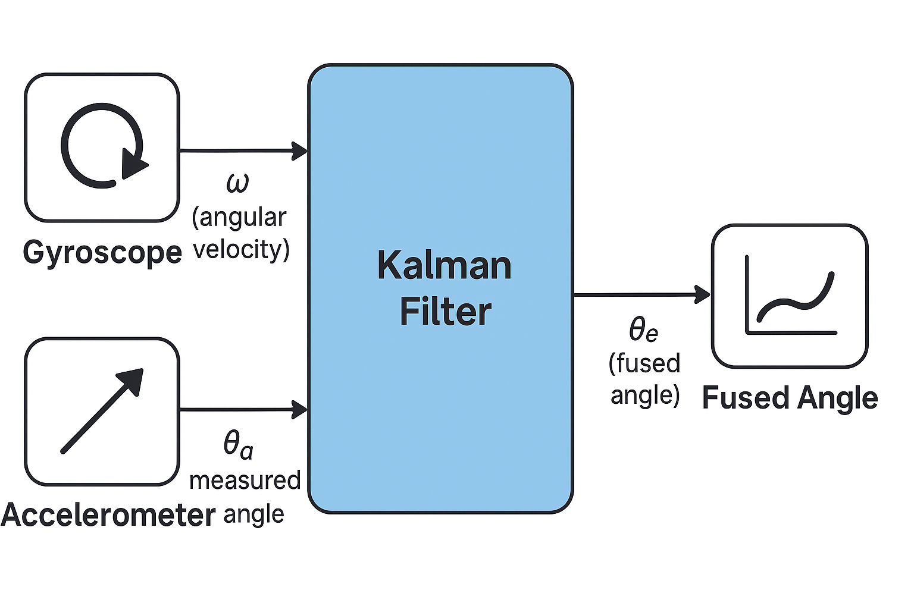
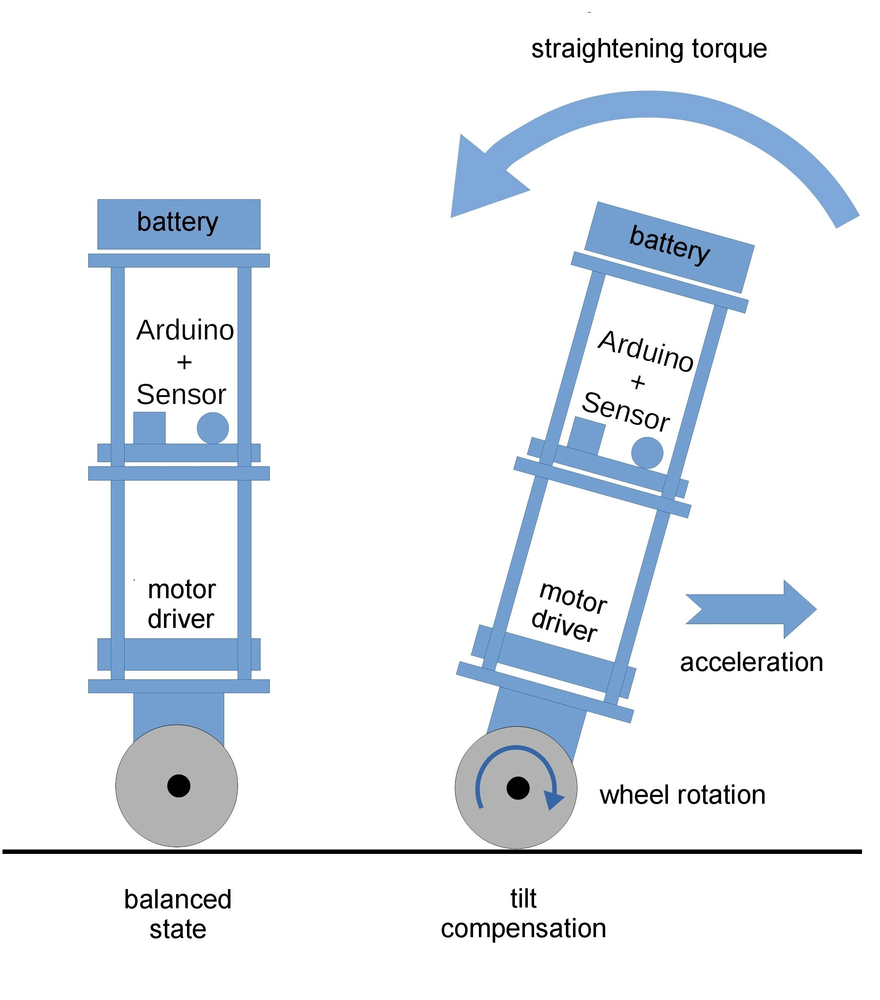

# Self-Balancing-Bot using Arudino and MPU 6050 gyroscope

A two-wheeled robot that maintains balance autonomously using PID control and sensor feedback.
### ⚙️ Features
  - Real time angle measurement using MPU6050 IMU
  - PID control loop for stabilization
  - Continuous rotation servo motor control
  - Adjustable PID gains for performance tuning
 
### 🔩 Hardware Used
  - Used an Arduino UNO for the mcrocontroller for the bot.
  - MPU6050 sensor which has both gyroscope and accelerometer capabilities for measuring the angle tilt of the bot.
  - 2 continous Servo Motors.
  - 3d printed chasis.
  - Battery pack.

### 💻 Libraries and Software Used
  - Software
    - Arudino IDE
  - Libraries
    - 'Wire.h' - Allows for the MPU 6050 to communicate with the Arduino using I2C protocol. We use I2C because the MPU 6050 gives us high resolution data which can't be transferred via the 0-5 V range of analog pins.
    - 'MPU6050_light.h' - Helps us to get clean angle data without writing all the complex code and math associated with it.
    - 'Servo.h' - Allows us to communicate with the servo motors.
    
### 🧠 How It Works

  - Sensor Data
    - The MPU 6050 gyroscope sensor continuously measures the bot's tilt angle.
    - This angle data gets filtered via the Kalman Filter, which combines gyroscope and accelerometer measurements to provide a more accurate and stable estimate of the actual angle.
    
      
  - Proportional Integral Derivative (PID) control algorithm
    - The PID algorithm calculates the error between the upright position (0 deg) and the current tilt angle.
    - PID controller computes corrective output.
    - Outputs motor speed required to achieve balance.
      
  - Actuation
    - The Arduino sends signals to both servo motors to compensate for tilt in real-time.

### Robot Setup Images

### Schematic 

### 📈 Results / Outcomes
- Maintains balance within ±5° of upright position after tuning.
- Improved stability by ~50% after optimizing PID variables.
- Robot could stand upright for 15+ seconds before losing consistency.

### 🧩 Challenges/Learning
- Tuning the PID constants took a lot of time  and effort since it's majority trial and error, hoping to get a value for your robot's spefication.
- When designing the chasis, it was difficult to decide where the components should go on the bot for the best weight distribution for the balance of the bot.

### How to run for yourself
1. Connect the components according to the wiring diagram.  
2. Install the required Arduino libraries (`MPU6050_light.h`, `Wire.h`).  
3. Open `SelfBalancingRobot.ino` in the Arduino IDE.  
4. Adjust PID constants if needed (`Kp`, `Ki`, `Kd`) (Most likely need to do this).   
5. Upload the sketch and power the robot.

### Possible Future Improvements
- Make it so that you can control the robot via bluetooth. 

### 📜 License
This project is licensed under the **MIT License** — feel free to use and modify it for educational or personal projects.

